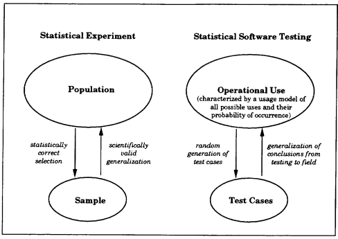
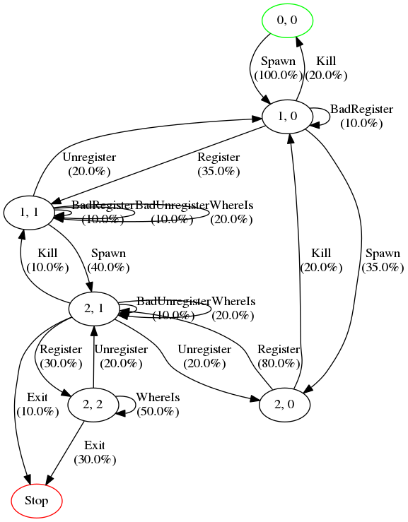

# Background

* Question: How do we measure the quality of our software?

* Started reading about the two software development processes:
    - *Cleanroom Software Engineering* (Mills et al) and;
    - *Software Reliability Engineering* (Musa et al)

* Today I'd like to share my interpretation of what those two camps have to say
  about the above question, and show how one might go about implementing
  (the testing part) of their ideas

---

# Overview

* What are *Cleanroom Software Engineering* and *Software Reliability
  Engineering*?

    - History, in what context where they developed
    - Main points of the two methods, focusing on the (statistical) testing part

* How can we implement their testing ideas using property-based testing

---

# Harlan Mills (1919-1996)

{ height=100px }\


* PhD in Mathematics, 1952
* Worked at IBM from 1964 to 1987
* Founded *Software Engineering Technology, Inc* in 1987 (later acquired by
  Q-Labs)
* Visiting professor (part-time), 1975-1987
* Adjunct professor, 1987-1995
* Published 6 books and some 50 articles

---

# What is *Cleanroom Software Engineering*?

* A complete software development process developed by Mills and many others at IBM
* Goal: Bug prevention, rather than removal (achieve or approach zero bugs)
* Controversial
    - Relies on formal methods/specifications, stepwise refinement, and
      design/code verification/review at each step to prevent bugs
    - Developers and testers are separate teams
    - Developers have no access to compilers, and are not supposed to write
      tests
    + Claims to be academic, criticised by Dijkstra
    - Testers job isn't to find bugs, but to measure the quality
* Many case studies with positive outcomes


[comment]: # (Management and team operation, Customer interaction, Incremental development, System specification, System design and implementation, Correctness verification, Statistical testing and reliability certification, Process improvement)

---

# John Musa (1933-2009)

{ height=100px }\


* Went to Naval ROTC, became an electrical officer

* Started working at AT&T Bell Labs in 1958

* Started working on SRE in 1973, while managing the work on an
  anti-ballistic missile system

* Published first paper *A Theory of Software Reliability and Its
  Application* [@musa75]

* Published 3 books and some 100 papers

[comment]: # (SRE has been an AT&T Best Current Practice since May 1991. To become a Best Current Practice, a practice must have substantial application (usually at least 8 to 10 projects) and this application must show a strong, documented benefit-to-cost ratio. For SRE, this ratio was 12 or higher for all projects. The practice undergoes a probing review by two boards, at third and fourth levels of management. More than 70 project managers or their representatives reviewed the SRE proposal. There were more than 100 questions and issues requiring resolution, a process that took several months. In 1991, SRE was one of five practices that were approved, out of 30 that were proposed.)

---

# What is *Software Reliability Engineering*?

* Also a development process, but not as complete as Cleanroom, developed by
  Musa and others at AT&T Bell Labs
* Goal: Estimate the time/cost to deliver software of some given quality/reliability
* Testing part overlaps greatly with that of Cleanroom Software Engineering
* SRE became best current practice at AT&T in 1991
* Adopted by many others after positive case studies

---

# Statistical testing and reliability certification

* Statistics in general: used when a population is too large to study, a
  statistically correct sample must be drawn as a basis for inference about the
  population

* Idea: Test the products of software engineers in the same way we test the
  products of other engineers

* Take a random sample of the product, test if it's correct with regards to the
  specification under operational use, make analytical and statistical
  inferences about the reliability, products meeting a standard are certified as
  fit for use

---

# Statistical testing as a statistical experiment

{ height=280px }

---

# Modelling operational use

* Operational use is captured by a usage model (Cleanroom) or an operational
  profile (SRE)

* We can define a usage model by asking the questions:
    1. Who are the customers and what are their users and their goals?
    2. What are the use cases?
    3. How often do the use cases happen in relation to each other?

* There are different ways encode this information, e.g. formal grammars
  (property-based testing) or Markov chains

---

# Usage model example, process registry

* What are the users? The developer that uses the process registry API:

```haskell
      spawn      :: IO Pid
      register   :: Pid -> Name -> IO ()
      whereis    :: Name -> IO Pid
      unregister :: Name -> IO ()
      kill       :: Pid -> IO ()
```

* What are the use cases? Calls to the API!

* How often do the use cases happen in relation to each other?
    - Spawning, registering, looking up names is the most likely happy path
    - The above with some unregisters and kills interleaved that happen with
      less frequently than the lookups seems realistic
    - If we want to be precise, we could e.g. study production logs

---

# Formal grammer usage model for process registry

```haskell
data Action = Spawn | Register Pid Name | Kill ...

gen :: (Int, Int) -> Gen [Action]
gen (spawned, registered) = case (spawned, registered) of
  (0, 0) -> liftM (Spawn :) (gen (1, 0))
  (1, 0) -> frequency
    [ (35, liftM (Register (Pid 0) (Name "0") :)
                 (gen (1, 1)))
    , (20, liftM (Kill (Pid 0) :) (gen (0, 0)))
    ]
  ...
```


---

# Markov chain usage model for process registry

{ height=320px }\


---

# Other uses of the Markov chain usage model

* Markov chains have been very well studied in statistics and other fields

* Examples of analytic computations we can do without running any tests:
    - Calculate the expected test case length
    - Number of test cases requried to cover all states/arcs in the usage model
    - Expected proportion of time spent in each state/arc
    - Expected number of test cases to first occurance of each state/arc
    - For more see @pro00 and the JUMBL tool

* The usage model can also guide development work (Pareto principle: 20% of use
  cases support 80% of the system use)

---

# Bernoulli sampling model for computing reliability

* Reliability = 1 - 1 / MTTF (mean time to failure, where time could be number
  of test cases) [See: @pmm93]

* Number of test cases = log(1 - Confidence) / log(Reliability)

* E.g. To achieve 0.999 reliability with 95% confidence we need 2995 test cases
  to pass without failure

* Idea: pick desired confidence and reliability, calculate number of test cases
  needed, use QuickCheck to generate said many test cases

* Shortcomings
    - Coarse-grained, did the whole test case succeed or not
    - Doesn't take test case length into account
    - Doesn't allow the presence of failures (consider flaky tests)

# Arc-based Bayesian model for computing reliability

* More fine-grained, count successful and unsuccessful state transitions (arcs)

* Compute the overall reliability (and variance) from the above, and taking the
  Markov chain probabilities and the probability mass for each sequence/test
  case

* More complicated, see @pp04, and @xlss18 for details

* There are other ways to compute the reliability, but this seems to be the
  latest one published in the literature that I could find. It's also used by
  the JUMBL tool

---

# A testing Markov chain constructed from test experience

{ height=320px }\


---

# Demo: Computing reliability for process registry example

[comment]: # (492ff8dab1836736ec7b3afdd27ccf381335ad71)

---

# Statistical testing inspired changes to standard property-based testing

* Generate programs using a Markov chain usage model
* Persist test results (about state transition reliability)
* Don't stop in presence of failures
* Compute reliability (and variance) from the usage model and test experience

---

# Conclusion and further work

* Compare to other ways of measuring quality? Cleanroom people claim:
    - Bugs/kloc: too developer centric
    - Code coverage: less cost effective

* Both statistical testing and property-based testing use a random sample, is
  there more we can learn from statistical testing than computing the
  reliability?
    - Can we add combinators to our property-based testing libraries to make it
      easier to do statistical testing?
    - Can we in a statistically sound way account for flakiness in tests this way?
    - How do we account for incremental development? When testing version *n +
      1* of some software, we should be able reuse some of the test experience
      from version *n*

---

# Questions?

---

# Extra slide: Notes from researching Mills and Musa

* Mills' [bibliography](https://dblp.uni-trier.de/pers/hd/m/Mills:Harlan_D=)
* Musa's [bibliography](https://dblp.uni-trier.de/pers/hd/m/Musa:John_D=)

* Q-Labs' collaboration with Software Engeinnering Technology is documented
  [here](http://www.q-labs.se/historia-18858838), it doesn't say anything about
  the acquisition though.

* Q-Labs later [became](https://www.linkedin.com/company/q-labs-ab) Addalot
  Consulting AB

* More about
  [Mills](https://www.computer.org/volunteering/awards/mills/about-mills)

* Interview with
  [Musa](https://www.researchgate.net/publication/259782514_A_Tribute_to_John_Musa_In_Memoriam)

* Dijkstra's (harsh)
  [comments](https://duckduckgo.com/lite?q=site:www.cs.utexas.edu/users/EWD%20harlan%20mills)
  on Mills' work

---

# References
